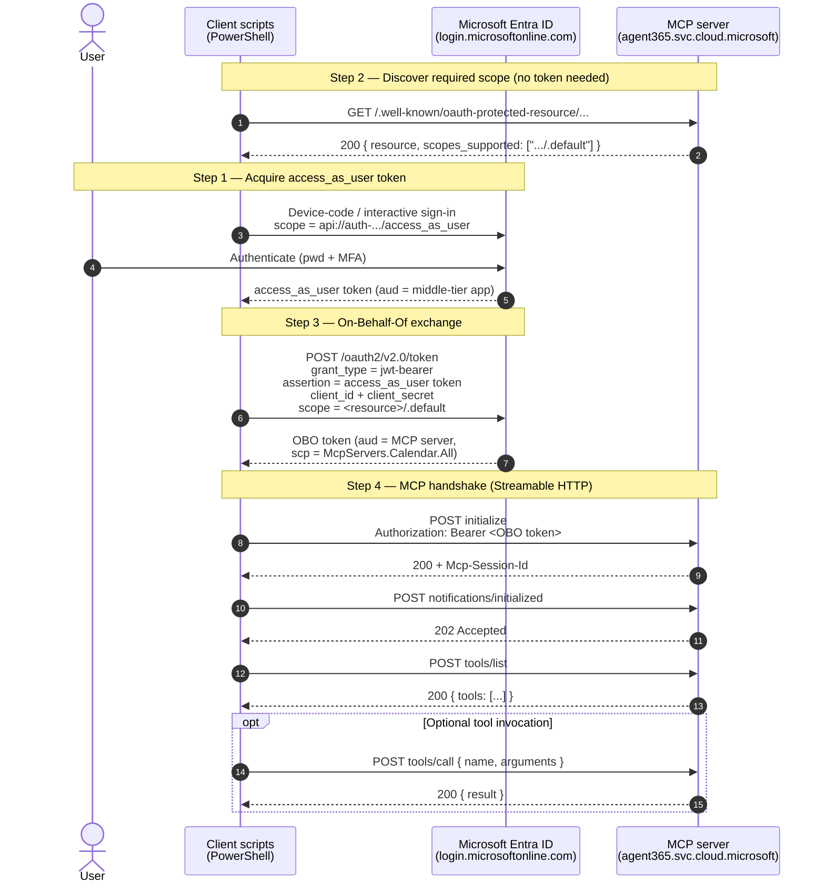

# Calling a WorkIQ / Agent365 MCP server from an `access_as_user` token

This folder contains PowerShell scripts that demonstrate, end to end, how to consume an
**MCP server** hosted by **Agent365 / WorkIQ** (e.g. `mcp_CalendarTools`) starting from a
user `access_as_user` token and going through an **On-Behalf-Of (OBO)** exchange.

> WorkIQ MCP servers authenticate via **Microsoft Entra ID**. MCP clients automatically
> discover the authentication configuration through the
> `/.well-known/oauth-protected-resource` endpoint (RFC 9728).

---

## 1. Flow overview

```
┌──────────────┐   access_as_user    ┌──────────────┐
│     User     │ ──────────────────► │  Middle-tier │  (1) Delegated sign-in
│  (sign-in)   │                     │  app 54881…  │
└──────────────┘                     └──────┬───────┘
                                            │ (2) Discover the scope
                                            │     via /.well-known/oauth-protected-resource
                                            ▼
                                     ┌──────────────┐
                                     │   Entra ID   │  (3) OBO:
                                     │  /oauth2/v2  │      assertion = access_as_user
                                     └──────┬───────┘      scope     = <resource>/.default
                                            │ token (aud = MCP server)
                                            ▼
                                     ┌──────────────┐
                                     │  MCP server  │  (4) initialize → tools/list → tools/call
                                     │ agent365 …   │      Authorization: Bearer <OBO token>
                                     └──────────────┘
```

The **4 steps**:

1. **`access_as_user`** — the user signs in; you get a delegated token for the API
   exposed by the middle-tier app.
2. **Discovery** — read the MCP server's `/.well-known/oauth-protected-resource` metadata
   to get the **resource (audience) and scope** it actually expects.
3. **OBO** — the middle-tier app (confidential client) exchanges the user token for a token
   whose **audience = the MCP server**.
4. **MCP call** — JSON-RPC handshake (`initialize`, `notifications/initialized`,
   `tools/list`, `tools/call`) over the **Streamable HTTP** transport, with the OBO token
   in the `Authorization: Bearer` header.

### Sequence diagram



---

## 2. Prerequisites

| Item | Value (example) |
|---|---|
| PowerShell module | `MSAL.PS` (auto-installed if missing) |
| PowerShell | 7.x |
| Tenant ID | `0c2614e6-a76a-433c-80fd-88ac91e67b9d` |
| Middle-tier app (client) | `54881055-411d-41b2-8f25-f1312a1abfe6` |
| `access_as_user` scope | `api://auth-…/54881055-…/access_as_user` |
| Client secret | stored in `$env:WORKIQ_CLIENT_SECRET` |

The middle-tier app must:
- expose the `access_as_user` scope (for step 1);
- have a **secret** or **certificate** (confidential client, for OBO);
- be granted the **required WorkIQ API permissions** (see *Work IQ API permissions
  reference*) so the OBO to the MCP server resource is authorized.

> ⚠️ **Security**: the secret is never passed as a command-line argument. It is read from
> `$env:WORKIQ_CLIENT_SECRET` (or prompted for securely).

---

## 3. Scripts provided

| Script | Role |
|---|---|
| `Get-WorkIQToken.ps1` | Step 1 — acquires the `access_as_user` token (interactive or device-code). |
| `Invoke-WorkIQObo.ps1` | Step 3 — OBO exchange to a given resource (`-Scope`). |
| `Invoke-WorkIQMcp.ps1` | Steps 2 & 4 — `.well-known` discovery, MCP handshake, `tools/list`, `tools/call`. |
| `Invoke-WorkIQMcpFlow.ps1` | **Orchestrator** — chains all 4 steps automatically. |

---

## 4. Quick start (orchestrator)

```powershell
# 1. The confidential-client secret (never in clear text on the command line)
$env:WORKIQ_CLIENT_SECRET = '<client-secret>'

# 2. The whole flow, with automatic scope discovery
.\Invoke-WorkIQMcpFlow.ps1 -DeviceCode

# 3. Cleanup
$env:WORKIQ_CLIENT_SECRET = $null
```

Call a concrete tool (`tools/call`):

```powershell
.\Invoke-WorkIQMcpFlow.ps1 -DeviceCode `
    -CallTool GetUserDateAndTimeZoneSettings `
    -ToolArgumentsJson '{"user":"me"}'
```

Target a different MCP server:

```powershell
.\Invoke-WorkIQMcpFlow.ps1 -ServerName mcp_CalendarTools -DeviceCode
```

---

## 5. Step by step (individual scripts)

### Step 1 — `access_as_user` token

```powershell
$user = .\Get-WorkIQToken.ps1 -DeviceCode
$user.AccessToken   # the delegated token
```

### Step 2 — discover the expected scope

```powershell
.\Invoke-WorkIQMcp.ps1 -DiscoverOnly
```

Typical response:

```json
{
  "resource_name": "mcp_CalendarTools",
  "resource": "https://agent365.svc.cloud.microsoft/agents/tenants/<tid>/servers/mcp_CalendarTools",
  "authorization_servers": ["https://login.microsoftonline.com/organizations/v2.0"],
  "scopes_supported": [
    "https://agent365.svc.cloud.microsoft/agents/tenants/<tid>/servers/mcp_CalendarTools/.default",
    "openid", "profile", "offline_access"
  ],
  "bearer_methods_supported": ["header"]
}
```

➡️ The scope to request via OBO is the one ending in `/.default`.

### Step 3 — OBO exchange

```powershell
$env:WORKIQ_CLIENT_SECRET = '<client-secret>'
$scope = 'https://agent365.svc.cloud.microsoft/agents/tenants/<tid>/servers/mcp_CalendarTools/.default'
$obo = .\Invoke-WorkIQObo.ps1 -UserAccessToken $user.AccessToken -Scope $scope
$obo.access_token   # audience = MCP server (e.g. aud = ea9ffc3e-…, scp = McpServers.Calendar.All)
```

### Step 4 — call the MCP server

```powershell
$endpoint = 'https://agent365.svc.cloud.microsoft/agents/tenants/<tid>/servers/mcp_CalendarTools'
.\Invoke-WorkIQMcp.ps1 -AccessToken $obo.access_token -Endpoint $endpoint
```

The script performs:
1. `initialize` → returns an `Mcp-Session-Id` (reused afterward);
2. `notifications/initialized` (HTTP 202);
3. `tools/list` → the list of available tools;
4. `tools/call` if `-CallTool` is provided.

---

## 6. MCP protocol details (Streamable HTTP)

- **Method**: `POST` to the server URL, JSON-RPC 2.0 body.
- **Headers**:
  - `Authorization: Bearer <OBO token>`
  - `Accept: application/json, text/event-stream`
  - `MCP-Protocol-Version: 2025-06-18`
  - `Mcp-Session-Id: <session>` (on requests after `initialize`)
- **Response**: `application/json` **or** `text/event-stream` (SSE). The scripts handle
  both (parsing `data:` lines for SSE).

Example `initialize` message:

```json
{
  "jsonrpc": "2.0",
  "id": 1,
  "method": "initialize",
  "params": {
    "protocolVersion": "2025-06-18",
    "capabilities": {},
    "clientInfo": { "name": "workiq-mcp-test", "version": "1.0.0" }
  }
}
```

---

## 7. Troubleshooting

| Symptom | Cause | Fix |
|---|---|---|
| `403 invalid_audience`: *"Third-party audience cannot access first-party server"* | The OBO token targets the **wrong resource** (e.g. `api://workiq.svc.cloud.microsoft` instead of the agent365 server). | Use the scope **discovered** via `/.well-known/oauth-protected-resource` (the `/.default` one). |
| `400 TenantIdInvalid` on `.well-known` | The `tenantId` is missing from the path. | The endpoint must include `/agents/tenants/<tid>/servers/<name>`. |
| `User canceled authentication` (interactive) | Sign-in window closed, or `http://localhost` not registered as a public-client redirect. | Use `-DeviceCode`, or register the public-client redirect. |
| OBO `AADSTS65001` / consent | The middle-tier app lacks permission on the MCP resource. | Grant admin consent for the required WorkIQ permissions. |
| Empty `appid` / `upn` in claims | **v2.0** token: those claims are named `azp` / `preferred_username`. | Expected; read `azp` and `preferred_username`. |

---

## 8. Claims reference (validated OBO token)

| Claim | Example | Meaning |
|---|---|---|
| `aud` | `ea9ffc3e-8a23-4a7d-836d-234d7c7565c1` | Audience = Agent365 MCP platform |
| `scp` | `McpServers.Calendar.All` | Granted delegated permission |
| `azp` | `54881055-…` | Calling app (middle-tier) |
| `azpacr` | `1` | Client authenticated with a secret |
| `idtyp` | `user` | Delegated (OBO) flow |
| `ver` | `2.0` | v2 token |
